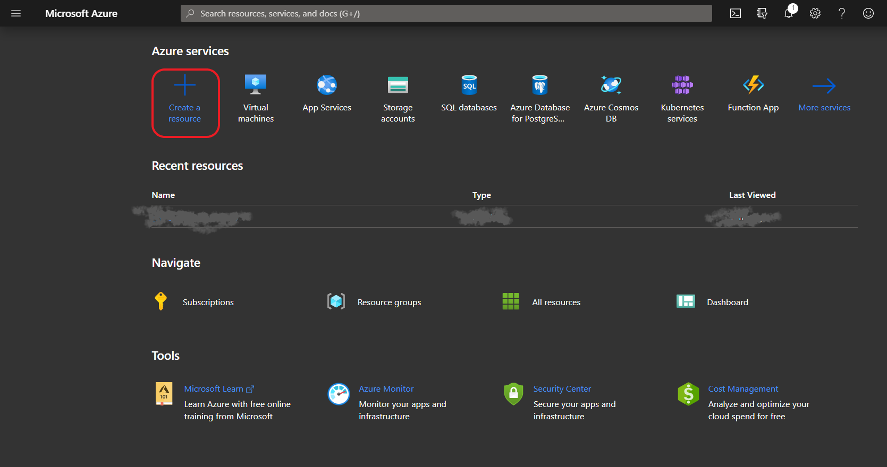
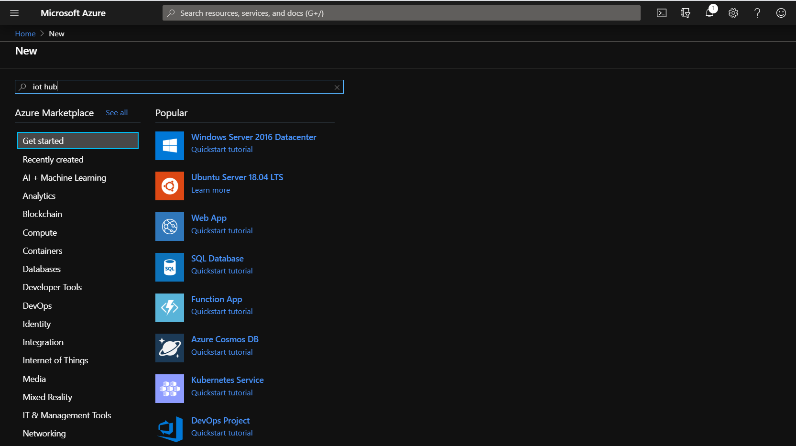
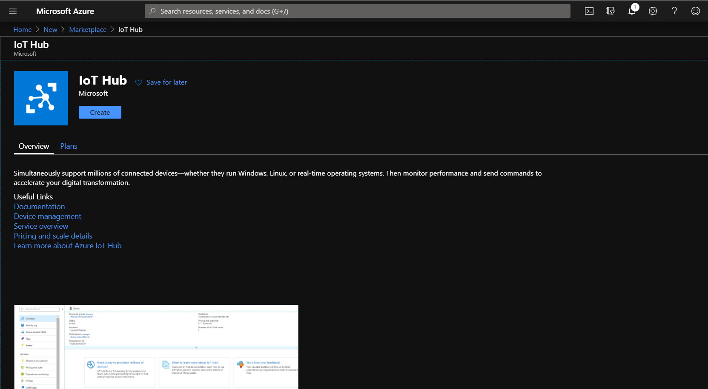
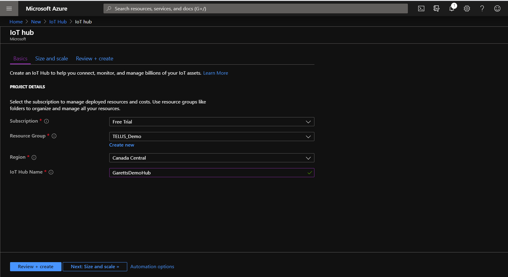
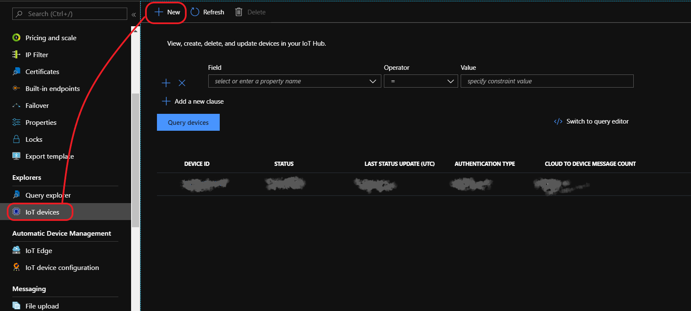
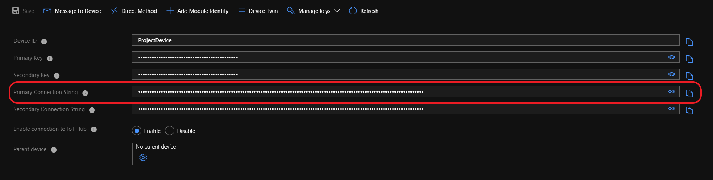
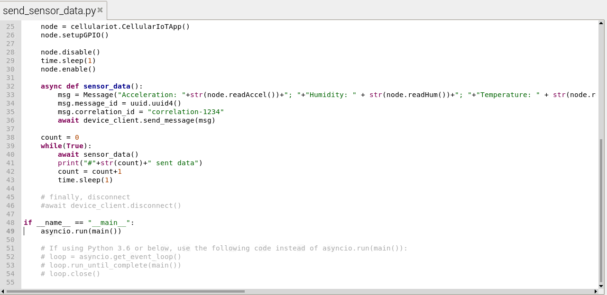

# Connect IoT Device to Azure

This tutorial guides users to connect their IoT Dev Kit to Azure Cloud using [azure-iot-sdk-python](https://github.com/Azure/azure-iot-sdk-python). Note that at this point, Raspian OS should have been set up and ready to use.

## Configuring Azure

### Setting up Azure account

To create an Azure account, please sign up [here](https://azure.microsoft.com/en-ca/) for a free trial which comes bundled with $250 of free credits.

### Creating IoT Hub

Once the account is created, please proceed to create a new IoT Hub from Azure dashboard using the “Create a resource” function:

Search for “IoT Hub”:

Click o  "Create". Give the IoT Hub a unique name, place it in the Canada East region and make sure Subscription is set to "Free Trial". The new IoT Hub should look similar to this:

Proceed to “Review and Create” then create an instance. This may take a couple of minutes.

Now the IoT Hub is created. This will be the central location for all IoT devices to connect and send whatever data which has been configured, and it gives a single point to read and action on that data. Azure has security built-in, all communications between the IoT devices to Azure will be secured and visibility to that data is also protected. 

### Creating IoT Device

The next step is to create an IoT Device instance within IoT Hub, this will be mapped directly to the physical IoT Device. Open the IoT Hub then, from the left-pane, select “IoT Devices”, then click the “New” button to create a new device.

Give the new device a name that is relevant, this is how the source of data sent to the Hub will be identified. Leave the other settings as-is (“Symmetric Keys” selected and “Auto-generate keys” checked). Click “Save”.

Now that the IoT device is created, click it to bring up its “Device Details” screen. From this screen copy the “Primary Connection String” and store it somewhere. This primary key will be loaded to the IoT device to secure the communications channel between it and the IoT Hub.

## Configuring IoT Device for Azure

1. Open terminal for Raspian. From the command-line, install [azure-iot-sdk-python](https://github.com/Azure/azure-iot-sdk-python) using the command: 

    `pip3 install azure-iot-device`

2. Azure CLI is a command-line tool which allows you to monitor the payloads sent from the device to Azure.

    * To install [Azure CLI](https://docs.microsoft.com/en-us/cli/azure/install-azure-cli-linux?view=azure-cli-latest), run the command: 
    
        `curl -L https://aka.ms/InstallAzureCli | bash`
        
    * When it finishes, restart your terminal. Then, log in to Azure using the command: `az login`. A browser will open, log in using Azure credentials.

    * Add IoT extension to Azure CLI

        `az extension add --name azure-cli-iot-ext`

    * Set the device Primary Connection String copied a few steps ago as an environment variable by: 

        `export IOTHUB_DEVICE_CONNECTION_STRING="<your connection string here>"`

    * Start monitoring by the command: 
        
        `az iot hub monitor-events --hub-name <your IoT Hub name> --output table`

    * Open another terminal window, `cd` into `Sixfab_RPi_CellularIoT_App_Shield/sample`
    
    * Check Python3 version by `python3 --version`, if the version is 3.6 or below, you need to modify `send_sensor_data.py`.
      
      Open the script `send_sensor_data.py` using an editor of choice, comment `line 49` and uncomment `line 52 to 54`
      
      

    * Run `send_sensor_data.py` to start sending sensor data to Azure.

        command: `python3 send_sensor_data.py`

        If the script runs successfully, you should start seeing data being sent to the Hub.
        
       
